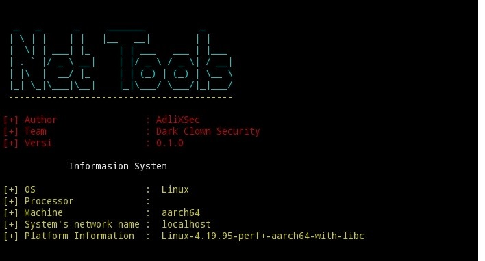

# Net Tools

 

## Tutorial

- $pkg update && pkg upgrade
- $pkg install python
- $pkg install git
- $git clone https://github.com/AdliXSec/NetTools
- $cd NetTools
- $python NetTools.py

### Note : 

- Jika pip masih versi lama, disarankan untuk upgrade pip
- Disarankan Installing Terlebih dahulu

## Warning

- jangan recode tools ini atau copy paste
- dan dilarang keras untuk disalah gunakan